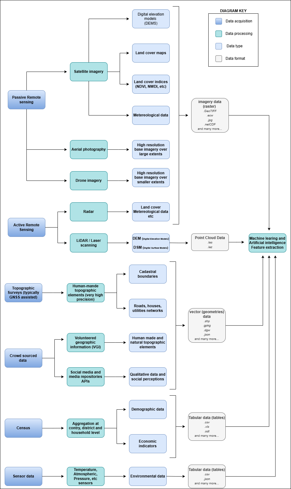
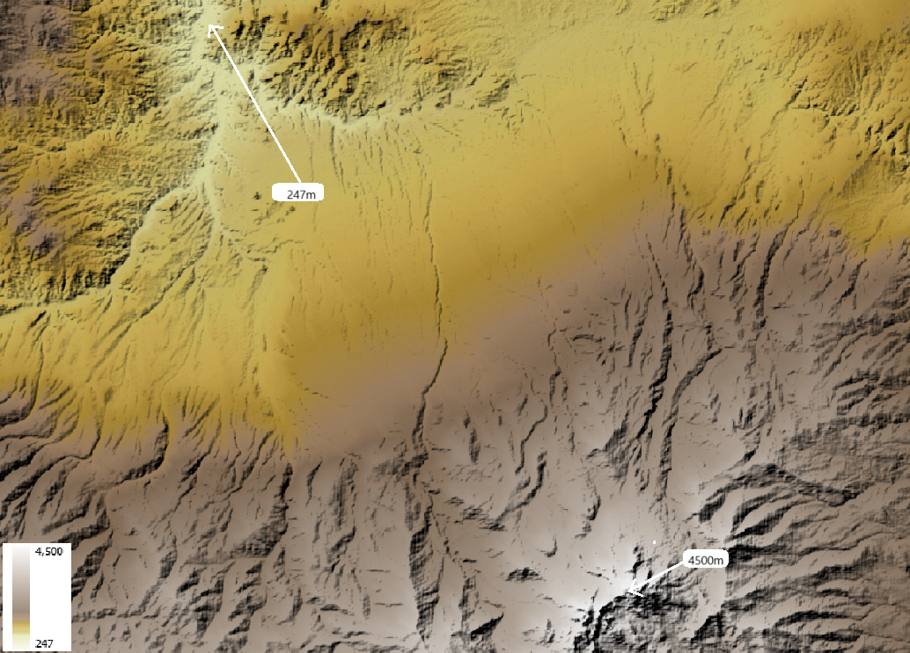

Data for Disaster Risk Managment
================================

.. important:: Session objectives

   After this session you should be able to:

   + Understand that a vast range of spatial data exist that may be useful for risk assessment Understand that different hazard types call for data with different spatial, spectral and temporal characteristics, and what we have to consider when trying to decide what to use Evaluate the different spatial, spectral and temporal characteristics of different data types Evaluate additional constraints that may influence which data set(s) we use in our risk assessment
   + Know where to search for and obtain some key thematic and image data types
   + Understand the basic concepts of 3D vision
   + List the most used remote sensing systems to create 3D for hazard studies
   + Create a 3D vision yourself using the ILWIS software

What is Spatial data?
^^^^^^^^^^^^^^^^^^^^^

In geoinformatics, also called geoinformation science, we use the term **spatial data** to describe any type of data that can be linked to a geographic place, usually via coordinates. This means that spatial data has an **unambiguous location** (i.e. it can be associated to a specific location on the Planet). The classic data type is a map, a more modern one could be a satellite image (for an introduction on remote sensing see box). However, we need to consider that our work is largely done digitally on a computer, and that we might want to use data that are actually quite variable in nature. When we think about disasters or risk, we may want to include:

+ Tabular data or statistics (e.g. on the number of hazard or disaster events of a certain type and in a given time period);
+ Thematic data (e.g. a road or river network, soil types, or digital elevation models [DEMs]);
+ Topographic maps;
+ Model results (e.g. for flood hazard or slope instability);
+ Images (e.g. aerial photos or satellite images).
+ Point cloud data (LIDAR and laser scans)

In the next section we will take a closer look into different types of data.

Main types of data
^^^^^^^^^^^^^^^^^^

First, it is important to distinguish between *data type* and *data format*. The first usually refers to the nature of the data, that is what type of information is the data documenting, while the latter describes what type of computer file are you talking about, including technical specifications.

Regardless of the type and format, *data acquisition* is done through the use sensors, surveys and other methods, after which *data processing* follows in order to distil useful information. We will not do an exhaustive list of data acquisition and processing methods, still, :numref:`data_type_data_format` provides an overview of the most relevant data types for Disaster Risk Management.

.. _data_type_data_format:

      Overview of the main data types

For example, you might find statistics presented in a table with either coordinates or grouped per administrative area, or illustrated as a chart or graphic. It can also happen that field photographs are available. Associating those with the other data, and integrating the information you think is useful in those photos with the rest of the analysis, can be challenging. Also consider that many maps or aerial photographs are available only as paper hardcopies. To use them in our work we first have to convert them to a digital format. This can be done by digitizing relevant information, or by scanning and subsequently georeferencing the maps or images.

Some of the data types mentioned in the diagram of :numref:`_data_type_data_format` deserve a closer look due to their importance for Disaster Risk Management. Among all the data types, those acquired through **remote sensing** deserve especial attention - if you want to dive a bit more into what exactly it is remote sensing, we invite you to expand the *What is remote sensing* dropdown.

.. dropdown:: What is remote sensing?
   :animate: fade-in
   :chevron: down-up
   :color: info
   :margin: 5

   Remote sensing (RS) can be described as the process of making measurements or observations without direct contact with the object being measured or observed. Thus, while in the geoinformatics context satellites often come to mind, even amateur photography is a form of RS. It usually results in images, but also includes other measurements, such as of temperatures or gravity.

   + **Sensors and platforms**. For remote sensing we normally require a **sensor** (i.e. a camera or scanner), but also something that carries the device. Such platforms can be airplanes or satellites, but also other instruments that allow us to place the sensor so that the area or object of interest is exposed, such as balloons or kites. The choice of platform directly affects what we can observe and how. Airplanes and helicopters are flexible in their operation, and by flying relatively low provide good spatial detail. However, such surveys can be expensive and regular imaging of the same area thus costly. Satellites fly on a fixed **orbit**, and are thus less flexible, but can provide data at regular intervals (think of trains on a track). We distinguish between so-called **polar orbiters**, whereby the satellites continuously circle the Earth at an altitude of some 500- 900km, passing over or near the poles. Normally only a relatively narrow strip of Earth underneath the sensor is observed. Modern satellites can also point the sensor sideways for greater flexibility. The other class of satellites is positioned in **geostationary orbit**. This means that the satellite is always directly above a designated place on the equator, moving with the rotating Earth at an altitude of 36,000 km. At that height the sensor can usually observe an entire hemisphere (the side of the Earth facing it), and provide data at any desired frequency. Many weather and communication satellites fall in this category, while most Earth observation satellites are polar orbiters.

   + **Collecting information**. The data we obtain depend primarily on the sensor type, just like you might take color or black/white photos with your camera. The secret to taking such different photos lies in the **electromagnetic energy** :numref:`the_em_spectrum`, which is what our sensors can detect. The most common source of energy is reflected sunlight, which, as you probably know, contains visible light, but also ultraviolet (UV), infrared (IR), thermal and other energy (Figure 2.1). Which part of this continuous energy band we capture depends on the sensor. Your camera might only capture visible light, while others can “see” UV, IR or thermal energy.

   .. _the_em_spectrum:
   .. figure:: _static/figures/data_for_disaster_risk_managment/the_em_spectrum.jpg
      :alt: The EM spectrum
      :figclass: align

      The EM spectrum

   + **The data**. The data our sensors record typically have the form of a grid, or raster (Figure 2.3). Rows and columns in that grid are populated by cells. These cells contain the information recorded by the sensor. A sensor can also have several **bands**, meaning that different sections of the electromagnetic spectrum are observed :numref:`grid_structure`. Thus for the area observed we will have an image that contains several bands, and the cell corresponding to a small part on the ground will have one data value for each band. The most important point to understand here is that different materials on the ground reflect energy in a characteristic spectral pattern. For example, vegetation is characterized by high energy in the near infrared (NIR), while for water the energy is very low. In figure 2.2 this would result in high values (digital numbers [DN]) for vegetation and low values for water in the band corresponding to the NIR.

   .. _grid_structure:
   .. figure:: _static/figures/data_for_disaster_risk_managment/grid_structure.png
      :alt: Grid structure of a multi-band image
      :figclass: align

      Grid structure of a multi-band image

   + **Displaying an image**. Once we have our data we can either display them directly on our monitor (if they are already digital), or first scan them. A monitor works with 3 different color channels (blue, green, red), and is able to generate any color (including black and white) with a combination of those 3 colors. Thus we can take an image with only 1 or with several bands and display 1 band at a time, thus as a **pan-chromatic** image :numref:`image_visualizations`. We can also use 3 bands and display them as a so- called **true-color composite** (B), which looks like the scene would look to us from space. However, we can essentially assign any of the image bands to one of the 3 colors. A typical combination, called a **false-color composite**, is shown in C, where the information from the  NIR band is displayed in red. Recall that vegetation leads to high DN values in the NIR, hence the high vegetation signal leads to a

   .. _image_visualizations:
   .. figure:: _static/figures/data_for_disaster_risk_managment/image_visualizations.png
      :alt: A – panchromatic, B- true-color, C and D – false color composites
      :figclass: align

      A – panchromatic, B- true-color, C and D – false color composites
       
   + **Enhancing an image**. Sometimes, for information to be made more visible, we have to enhance the image. One typical form is **stretching**. Our displays are typically able to display 256 brightness levels for each color, corresponding to 8bit. However, very often the image data only have a limited range, say with DNs between 50 and 150, where are not very bright or very dark features on the ground. To achieve a display with a richer contrast we can stretch the data over the entire available range (0-255). The same concept applies to other data types you will work with, for example elevation. The elevation file for our test area ranges between approximately 900 and 1350m. By default they will be stretched over the available display range. However, we can also stretch a small value range, say 950-1000, to highlight more details. Another common enhancing method is **filtering** :numref:`filtering`. This is a so-called neighborhood analysis, often used to smoothen an image or to highlight edges. In the example the average of all cells shown in grey in the input image is calculated and written to a new file, before the filter template moves to the next pixel (hatched box). Many filter types have been developed, which you will also use in the ILWIS exercises (for example shadow and smoothing filters).

    .. _filtering:
    .. figure:: _static/figures/data_for_disaster_risk_managment/filtering.jpg
      :alt: Input and output result of filtering:  In this case, a smoothing filter was applied.
      :figclass: align

      Input and output result of filtering:  In this case, a smoothing filter was applied.

    + **Other factors influencing our data**. RS data come in many forms, often described by **sensor type**, as well as **spatial, temporal** and **spectral resolution**. Sensors recording reflected sunlight or energy emitted by the earth are called **passive sensors**. However, we also have sensors that emit their own energy, which is reflected by the earth, just like you use a flash on your camera. These are **active sensors**, well-known examples being radar (see Figure 2.10) or laser scanning. The **spatial resolution** describes the size of the ground area represented in a single pixel. This largely depends on the distance between the sensor and the object. While aerial photos may have a resolution of a few cm, data from polar orbiters range between about 50 cm and 1 km per cell. Sensors on geostationary satellites, being very far away, record data at resolutions of a few km. The **temporal** resolution describes the possible frequency of repeat observations. For aerial surveys this can be years. Depending on the type of polar orbiter and sensor, their temporal resolution varies between approx. 1 and 44 days, while geostationary sensors record data up to every 15 minutes. The **spectral** resolution describes how narrow a slice of the EM spectrum a sensor band records.

**Digital Elevation Models (DEM)** are consist of a single band image where the pixel value represents the elevation of that location :numref:`DEM of the Savalan Peak (Iran) based on SRTM data`. They are a fundamental and indispensable dataset for many applications because there are many other informations that can be derived from it, especially when it comes to hydrology. In fact, delineation of catchment areas, streams, flood simulations cannot be done without a DEM as input.

.. _bala_savalan_peak_(Iran)_DEM_srtm:

      DEM of the Savalan Peak (Iran) based on SRTM data

DEM are also essential for all sort of landscape analysis for their unique ability to provide an intuitive reading on the main features of an area: where are the mountains, the valleys, the flat areas and so on :numref`dem_animation.gif`:

.. _dem_animation:
.. figure:: _static/figures/data_for_disaster_risk_managment/dem_animation.gif
      :alt: 3D visualization of the DEM of the Savalan Peak (Iran) based on SRTM data
      :figclass: align

      3D visualization of the DEM of the Savalan Peak (Iran) based on SRTM data

Main types of data (Remote Sensing, Digital Elevation, Meteo data)
^^^^^^^^^^^^^^^^^^^^^^^^^^^^^^^^^^^^^^^^^^^^^^^^^^^^^^^^^^^^^^^^^^

Main sources of data
^^^^^^^^^^^^^^^^^^^^

Data sharing and dissemination (1-1.5 hour exercise)
^^^^^^^^^^^^^^^^^^^^^^^^^^^^^^^^^^^^^^^^^^^^^^^^^^^^

Data quality (granularity, fitness for purpose)
^^^^^^^^^^^^^^^^^^^^^^^^^^^^^^^^^^^^^^^^^^^^^^^

Data sovereignty (control , licensing)
^^^^^^^^^^^^^^^^^^^^^^^^^^^^^^^^^^^^^^
