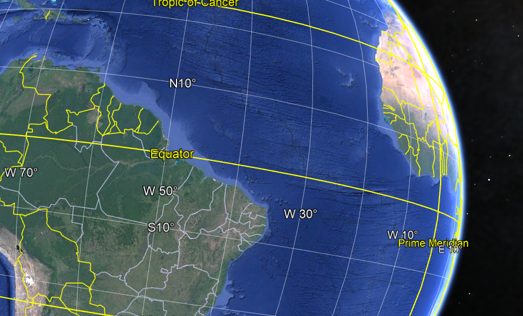

Data for Disaster Risk Managment
================================

.. important:: Session objectives

   After this session you should be able to:

   + Understand that a vast range of spatial data exist that may be useful for risk assessment Understand that different hazard types call for data with different spatial, spectral and temporal characteristics, and what we have to consider when trying to decide what to use Evaluate the different spatial, spectral and temporal characteristics of different data types Evaluate additional constraints that may influence which data set(s) we use in our risk assessment
   + Know where to search for and obtain some key thematic and image data types
   + Understand the basic concepts of 3D vision
   + List the most used remote sensing systems to create 3D for hazard studies
   + Create a 3D vision yourself using the ILWIS software

This a link to the `Faculty ITC`_. ITC works with Earth Observation like seen in :numref:`session_0_figure0`:

.. _session_0_figure0:

   The Earth as seen on Google Earth

We can also add colapsable boxes like this:

.. dropdown:: What is remote sensing?
   :animate: fade-in
   :chevron: down-up
   :color: info
   :margin: 5

   Remote sensing is the acquisition of information about an object or phenomenon without making physical contact with the object, in contrast to in situ or on-site observation. The term is applied especially to acquiring information about Earth and other planets. Remote sensing is used in numerous fields, including geophysics, geography, land surveying and most Earth science disciplines (e.g. exploration geophysics, hydrology, ecology, meteorology, oceanography, glaciology, geology). It also has military, intelligence, commercial, economic, planning, and humanitarian applications, among others.

   In current usage, the term remote sensing generally refers to the use of satellite- or aircraft-based sensor technologies to detect and classify objects on Earth. It includes the surface and the atmosphere and oceans, based on propagated signals (e.g. electromagnetic radiation). It may be split into "active" remote sensing (when a signal is emitted by a satellite or aircraft to the object and its reflection is detected by the sensor) and "passive" remote sensing (when the reflection of sunlight is detected by the sensor)

Main types of data (Remote Sensing, Digital Elevation, Meteo data)
------------------------------------------------------------------

Main sources of data
--------------------

Data sharing and dissemination (1-1.5 hour exercise)
----------------------------------------------------

Data quality (granularity, fitness for purpose)
-----------------------------------------------

Data sovereignty (control , licensing)
--------------------------------------
