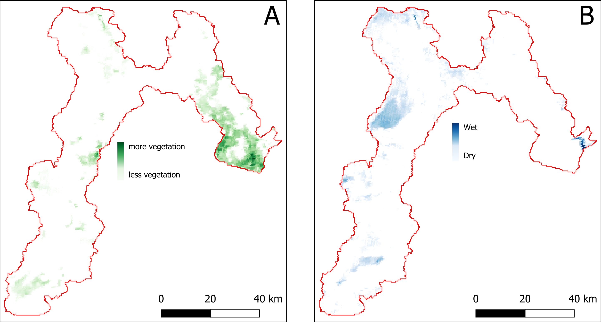
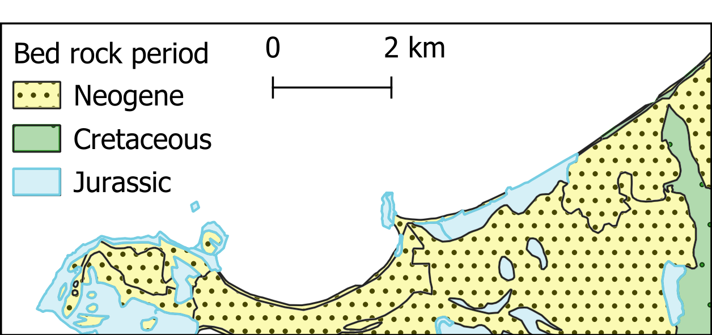
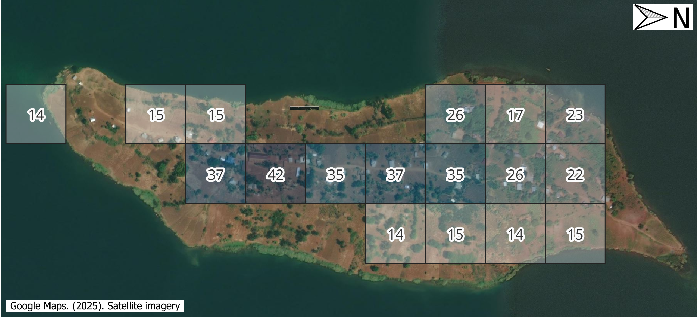
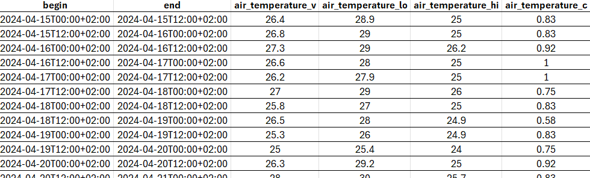

=================================
Data for Disaster Risk Management
=================================

.. important:: Overall objectives

   After this session you should be able to:

   + Recognize the variety of spatial data available for risk assessment and how different hazards require specific spatial, spectral, and temporal characteristics. Assess these characteristics across data types while considering additional constraints that impact data selection;
   + Understand what data sovereignty is and why it is important.

.. note:: What will you learn

   In this session you will how learn to:

   + Search and obtain key datasets;
   + Evaluate the quality of a dataset with regards to its suitability for a purpose;

What is Spatial data?
=====================

In geoinformatics, also called geoinformation science, we use the term **spatial data** to describe any type of data that can be linked to a geographic place, usually via coordinates. This means that spatial data has an **unambiguous location** (i.e. it can be associated to a specific location on the Planet). The classic data type is a map, a more modern one could be a satellite image (for an introduction on remote sensing see box). However, we need to consider that our work is largely done digitally on a computer, and that we might want to use data that are actually quite variable in nature. When we think about disasters or risk, we may want to include:

+ Tabular data or statistics (e.g. on the number of hazard or disaster events of a certain type and in a given time period);
+ Thematic data (e.g. a road or river network, soil types, or digital elevation models [DEMs]);
+ Topographic maps;
+ Model results (e.g. for flood hazard or slope instability);
+ Images (e.g. aerial photos or satellite images).
+ Point cloud data (LIDAR and laser scans)

In the next section we will take a closer look into different types of data.

Main types of data
==================

First, it is important to distinguish between *data type* and *data format*. The first usually refers to the nature of the data, that is what type of information is the data documenting, while the latter describes what type of computer file are you talking about, including technical specifications.

Regardless of the type and format, *data acquisition* is done through the use sensors, surveys and other methods, after which *data processing* follows in order to distil useful information. We will not do an exhaustive list of data acquisition and processing methods, still, :numref:`data_type_data_format` provides an overview of the most relevant data types for Disaster Risk Management.

.. _data_type_data_format:

      Overview of the main data types

For example, you might find statistics presented in a table with either coordinates or grouped per administrative area, or illustrated as a chart or graphic. It can also happen that field photographs are available. Associating those with the other data, and integrating the information you think is useful in those photos with the rest of the analysis, can be challenging. Also consider that many maps or aerial photographs are available only as paper hardcopies. To use them in our work we first have to convert them to a digital format. This can be done by digitizing relevant information, or by scanning and subsequently georeferencing the maps or images.

Some of the data types mentioned in the diagram of :numref:`data_type_data_format` deserve a closer look due to their importance for Disaster Risk Management. Among all the data types, those acquired through **remote sensing** deserve especial attention - if you want to dive a bit more into what exactly it is remote sensing, we invite you to expand the *What is remote sensing* dropdown.

.. dropdown:: What is remote sensing?
   :animate: fade-in
   :chevron: down-up
   :color: info
   :margin: 5

   Remote sensing (RS) can be described as the process of making measurements or observations without direct contact with the object being measured or observed. Thus, while in the geoinformatics context satellites often come to mind, even amateur photography is a form of RS. It usually results in images, but also includes other measurements, such as of temperatures or gravity.

   + **Sensors and platforms**. For remote sensing we normally require a **sensor** (i.e. a camera or scanner), but also something that carries the device. Such platforms can be airplanes or satellites, but also other instruments that allow us to place the sensor so that the area or object of interest is exposed, such as balloons or kites. The choice of platform directly affects what we can observe and how. Airplanes and helicopters are flexible in their operation, and by flying relatively low provide good spatial detail. However, such surveys can be expensive and regular imaging of the same area thus costly. Satellites fly on a fixed **orbit**, and are thus less flexible, but can provide data at regular intervals (think of trains on a track). We distinguish between so-called **polar orbiters**, whereby the satellites continuously circle the Earth at an altitude of some 500- 900km, passing over or near the poles. Normally only a relatively narrow strip of Earth underneath the sensor is observed. Modern satellites can also point the sensor sideways for greater flexibility. The other class of satellites is positioned in **geostationary orbit**. This means that the satellite is always directly above a designated place on the equator, moving with the rotating Earth at an altitude of 36,000 km. At that height the sensor can usually observe an entire hemisphere (the side of the Earth facing it), and provide data at any desired frequency. Many weather and communication satellites fall in this category, while most Earth observation satellites are polar orbiters.

   + **Collecting information**. The data we obtain depend primarily on the sensor type, just like you might take color or black/white photos with your camera. The secret to taking such different photos lies in the **electromagnetic energy** :numref:`the_em_spectrum`, which is what our sensors can detect. The most common source of energy is reflected sunlight, which, as you probably know, contains visible light, but also ultraviolet (UV), infrared (IR), thermal and other energy (Figure 2.1). Which part of this continuous energy band we capture depends on the sensor. Your camera might only capture visible light, while others can “see” UV, IR or thermal energy.

   .. _the_em_spectrum:
   .. figure:: _static/figures/data_for_disaster_risk_managment/the_em_spectrum.jpg
      :alt: The EM spectrum
      :figclass: align

      The EM spectrum

   + **The data**. The data our sensors record typically have the form of a grid, or raster. Rows and columns in that grid are populated by cells. These cells contain the information recorded by the sensor. A sensor can also have several **bands**, meaning that different sections of the electromagnetic spectrum are observed :numref:`grid_structure`. Thus for the area observed we will have an image that contains several bands, and the cell corresponding to a small part on the ground will have one data value for each band. The most important point to understand here is that different materials on the ground reflect energy in a characteristic spectral pattern. For example, vegetation is characterized by high energy in the near infrared (NIR), while for water the energy is very low. In figure 2.2 this would result in high values (digital numbers [DN]) for vegetation and low values for water in the band corresponding to the NIR.

   .. _grid_structure:
   .. figure:: _static/figures/data_for_disaster_risk_managment/grid_structure.png
      :alt: Grid structure of a multi-band image
      :figclass: align

      Grid structure of a multi-band image

   + **Displaying an image**. Once we have our data we can either display them directly on our monitor (if they are already digital), or first scan them. A monitor works with 3 different color channels (blue, green, red), and is able to generate any color (including black and white) with a combination of those 3 colors. Thus we can take an image with only 1 or with several bands and display 1 band at a time, thus as a **pan-chromatic** image :numref:`image_visualizations`. We can also use 3 bands and display them as a so- called **true-color composite** (B), which looks like the scene would look to us from space. However, we can essentially assign any of the image bands to one of the 3 colors. A typical combination, called a **false-color composite**, is shown in C, where the information from the  NIR band is displayed in red. Recall that vegetation leads to high DN values in the NIR, hence the high vegetation signal leads to a

   .. _image_visualizations:
   .. figure:: _static/figures/data_for_disaster_risk_managment/image_visualizations.png
      :alt: A – panchromatic, B- true-color, C and D – false color composites
      :figclass: align

      A – panchromatic, B- true-color, C and D – false color composites
       
   + **Enhancing an image**. Sometimes, for information to be made more visible, we have to enhance the image. One typical form is **stretching**. Our displays are typically able to display 256 brightness levels for each color, corresponding to 8bit. However, very often the image data only have a limited range, say with DNs between 50 and 150, where are not very bright or very dark features on the ground. To achieve a display with a richer contrast we can stretch the data over the entire available range (0-255). The same concept applies to other data types you will work with, for example elevation. The elevation file for our test area ranges between approximately 900 and 1350m. By default they will be stretched over the available display range. However, we can also stretch a small value range, say 950-1000, to highlight more details. Another common enhancing method is **filtering** :numref:`filtering`. This is a so-called neighborhood analysis, often used to smoothen an image or to highlight edges. In the example the average of all cells shown in grey in the input image is calculated and written to a new file, before the filter template moves to the next pixel (hatched box). Many filter types have been developed, which you will also use in the ILWIS exercises (for example shadow and smoothing filters).

    .. _filtering:
    .. figure:: _static/figures/data_for_disaster_risk_managment/filtering.jpg
      :alt: Input and output result of filtering:  In this case, a smoothing filter was applied.
      :figclass: align

      Input and output result of filtering:  In this case, a smoothing filter was applied.

    + **Other factors influencing our data**. RS data come in many forms, often described by **sensor type**, as well as **spatial, temporal** and **spectral resolution**. Sensors recording reflected sunlight or energy emitted by the earth are called **passive sensors**. However, we also have sensors that emit their own energy, which is reflected by the earth, just like you use a flash on your camera. These are **active sensors**, well-known examples being radar (see Figure 2.10) or laser scanning. The **spatial resolution** describes the size of the ground area represented in a single pixel. This largely depends on the distance between the sensor and the object. While aerial photos may have a resolution of a few cm, data from polar orbiters range between about 50 cm and 1 km per cell. Sensors on geostationary satellites, being very far away, record data at resolutions of a few km. The **temporal** resolution describes the possible frequency of repeat observations. For aerial surveys this can be years. Depending on the type of polar orbiter and sensor, their temporal resolution varies between approx. 1 and 44 days, while geostationary sensors record data up to every 15 minutes. The **spectral** resolution describes how narrow a slice of the EM spectrum a sensor band records.

Digital Elevation Models (DEM)
******************************

**Digital Elevation Models (DEM)**  consist of a single band image where the pixel value represents the elevation of that location :numref:`bala_savalan_peak_(Iran)_DEM_srtm`. They are a fundamental and indispensable dataset for many applications because there are many other informations that can be derived from it, especially when it comes to hydrology. In fact, delineation of catchment areas, streams, flood simulations cannot be done without a DEM as input.

.. _bala_savalan_peak_(Iran)_DEM_srtm:

      DEM of the Savalan Peak (Iran) based on SRTM data

DEM are also essential for all sort of landscape analysis for their unique ability to provide an intuitive reading on the main features of an area: where are the mountains, the valleys, the flat areas and so on :numref:`dem_animation`:

.. _dem_animation:
.. figure:: _static/figures/data_for_disaster_risk_managment/dem_animation.gif
      :alt: 3D visualization of the DEM of the Savalan Peak (Iran) based on SRTM data
      :figclass: align

      3D visualization of the DEM of the Savalan Peak (Iran) based on SRTM data

Land Cover Maps
***************

Land Cover maps are a form of thematic data where the map is made of mutually exclusive categories that are defined according to the prevalent land cover.
For example, a land cover map with four categories could include *water*, *green area*, *dry area*, and *urbanized*. Land cover maps are often confused with land use maps, and the two terms are mistakenly used interchangeably. Land cover refers to the actual physical surface of an area—what dominates the landscape :numref:land_cover_enschede.
In contrast, land use maps document how people utilize the land. For instance, green area describes the land cover, but park is a land use category, not a cover type.

.. _land_cover_enschede:

      Land cover map of Enschede (The Netherlands) based on Sentinel 2 imagery (2016)

Land cover maps are typically produced by classifying multi-spectral satellite imagery using a range of machine learning and supervised classification techniques. These methods aim to cluster pixels based on radiometric similarity. The accuracy of the classification is then assessed by evaluating whether the assigned categories correctly match the actual land cover.
The more localized a land cover map is, the more accurate and representative the land cover classes tend to be. However, there exists land cover maps at global scale that might be useful even when used for large scale mapping. See for example `Worldwide land cover mapping <Worldwide land cover mapping_>`_

Land Cover Indices
******************

Land Cover Indices are derived from remotely sensed data, primarily multi-spectral satellite imagery, and are expressed on a numerical scale, typically ranging from -1 to 1. Higher values indicate a greater likelihood that the physical characteristic measured by the index is present. These indices are widely used in environmental monitoring, agriculture, urban planning and may also be very useful for disaster risk managing. Indices allow us to analyze vegetation, water bodies, soil, and built-up areas.
A few of these indices are very commonly used:

* Normalized Difference Vegetation Index (NDVI) – Measures vegetation health and density. Defined as:

.. math::

   NDVI = \frac{(NIR - RED)}{(NIR + RED)}

* Normalized Difference Water Index (NDWI) – Indicates the presence of water on the surface (water bodies).

.. math::

   NDWI = \frac{(GREEN - NIR)}{(GREEN + NIR)}

Representing physical characteristics as an indice is a very useful indicator that also allows for a fast and intuitive assessment of complex phenomenon :numref:`indeces_ndvi_ndwi`. There are many indices built on top of remote sensed imagery, you can check this page for a `list of indices <list of indices_>`_

.. _indeces_ndvi_ndwi:

      NDVI (A) and NDWI (B) indeces for the Sistan Basin, in Iran, as of January 2005.

Aerial and drone photography
****************************

Despite the increasing availability and quality of satellite imagery, mounting a photographic camera on an aerial vehicle is widely used and covers use cases for which satellite imagery is not the best option. In simple terms, if small object recognition is a requirement, then we need imagey that is suitable for small scale mapping.
The biggest difference between satellite and aerial and drone imagery is the spatial resolution that is higher in the latter :numref:`satellite_arerial_drone_imagery`. Commercial satellites offer spacial resolutions, for True colour of up to 3m while with aerial and drone photography we can have imagery with centimetric spatial resolution.

.. _satellite_arerial_drone_imagery:
.. figure:: _static/figures/data_for_disaster_risk_managment/satellite_arerial_drone_imagery.png
      :alt: Imagery documenting Caldas da Rainha, Portugal: (A) Sentinel-2 satellite imagery with a spatial resolution of 10m; (B) a highlighted section of the city captured in aerial photography with a resolution of 10cm; (C) the same highlighted section using drone imagery at 2cm resolution. Notice how the detail increases.
      :figclass: align

      Imagery documenting Caldas da Rainha, Portugal: (A) Sentinel-2 satellite imagery with a spatial resolution of 10m; (B) a highlighted section of the city captured in aerial photography with a resolution of 10cm; (C) the same highlighted section using drone imagery at 2cm resolution. Notice how the detail increases.

Aerial photography is usually comissioned by national agencies to obtain a detailed based map for the whole country or a particular region, while drone imagery, due to the logistic challenge of scaling it up to large areas, is usually applied to cover localized areas like a development plan or a particular part of a city.

Radar data
**********

Radar data is obtained from active remote sensing satellites that emit energy waves in the microwave region of the electromagnetic spectrum toward the Earth's surface. These waves then bounce back after interacting with the surface. By analyzing the time delay and characteristics of the returning signal, it is possible to distinguish surface features and objects once the data is processed into an image.

The main advantage of radar data—such as that provided by Synthetic Aperture Radar (SAR) sensors onboard the Sentinel-1 satellites—is that meteorological conditions like cloud cover do not affect data quality. This is in contrast to optical sensors, which depend on clear skies to capture usable imagery. Therefore, radar is an extremely valuable tool for near real-time monitoring of hazards commonly associated with cloud coverage, such as floods :numref:`radar_imagery`.

.. _radar_imagery:
.. figure:: _static/figures/data_for_disaster_risk_managment/radar_imagery.png
      :alt: Example of radar imagery showing water (depicted by dark pixels). The image compares the same region in April 2016 (pre-flood event) to the peak of the flood in August 2016. Cloud coverage did not impede the acquisition of useful imagery.
      :figclass: align

      Example of radar imagery showing water (depicted by dark pixels). The image compares the same region in April 2016 (pre-flood event) to the peak of the flood in August 2016. Cloud coverage did not impede the acquisition of useful imagery.

LiDAR data
**********

LiDAR or *Light Detection and Ranging* is also an active remote sensing system that can be used to generate very high resolution (in other words, detailed) Digital Elevation and Digital Surface Models :numref:`lidar`

.. dropdown:: Difference between DEM and DSM
   :animate: fade-in
   :chevron: down-up
   :color: info
   :margin: 5

   Although DEM (Digital Elevation Models) and DSM (Digital Surface Models) are often mentioned interchangeably, they have slightly different meaning:

   + **DEM** Is a representation of the topography without any other features like constructions or trees. It represents the height of 'bare earth' only :numref:`dem_vs_dsm`.

   + **DSM** In turn, is a representation of the topography that includes features that are on the 'bare soil' like houses and vegetation :numref:`dem_vs_dsm`.

   .. _dem_vs_dsm:
   .. figure:: _static/figures/data_for_disaster_risk_managment/dem_vs_dsm.png
      :alt: Same area as a DEM (A) and DSM (B). Note how the DSM is representing the top of the trees and that reflects in the elevation values.
      :figclass: align

      Same area as a DEM (A) and DSM (B). Note how the DSM is representing the top of the trees and that reflects in the elevation values

.. _lidar:
.. figure:: _static/figures/data_for_disaster_risk_managment/lidar.gif
      :alt: DSM of the Neštich hillfort above Svätý Jur (Slovenia) made from LiDAR data (2016)
      :figclass: align

      DSM of the Neštich hillfort above Svätý Jur (Slovenia) made from LiDAR data (2016)

LiDAR data acquisition is performed using a laser beam, typically mounted on an aircraft. The laser "fires" pulses toward the Earth's surface, with point densities typically ranging from 1 to 100 points per square meter. Higher point densities provide more detailed data but also require more intensive processing.

The collected data forms a point cloud consisting of millions of points, each represented by XYZ coordinates. These coordinates are determined by measuring the time it takes for the laser beam to reach an object and reflect back to the sensor.

One particularly interesting application of high-density point clouds is their ability to penetrate vegetation and capture multiple layers of information. This allows for the identification of different levels, such as bare soil, intermediate vegetation, and the top of the tree canopy :numref:`lidar_flying`.

   .. _lidar_flying:
   .. figure:: _static/figures/data_for_disaster_risk_managment/lidar_flying.gif
      :alt: Animation illustrating the level of detail collected with a LiDAR sensor mounted on an airplane.
      :figclass: align

      Animation illustrating the level of detail collected with a LiDAR sensor mounted on an airplane

Topographic maps
****************

Topographic maps are the result of surveys using traditional optical survey methods like total stations and theodolites, but nowadays, these surveys are typically assisted by GPS measurements and can be complemented with other aerial imagery or even LiDAR and other sensors.
Topographic maps include two big groups of information: man-made structures like roads and buildings and natural features with a great emphasis on altitude measurements that are on the base of terain representations and the deliniation of landscape features like ridges, valleys and water bodies :numref:`topographic_map_example`

.. _topographic_map_example:

      Detail of a topographic map the Tehachapi Mountains (California, USA). Section of "The National Map" by USGS

Modern topographic maps are actually a composition of several distinct datasets that were acquired using a myriad of different techniques, however in many countries old paper based topographic maps continue to be a precious source of information.
When a map is made of a a subset of of topographic elements in order to document a specific theme, we call it a 'thematic map'. Common thematic maps include natural features like geology :numref:`geology_map` or man-made elements like communications and cadastral maps (or other delimitations) :numref:`cadastral_map_dorset`.

.. _geology_map:

      Thematic map of the geology from the peninsula of Peniche (Portugal)

.. _cadastral_map_dorset:

      Thematic map of the land parcels and roads from Dorset (Tasmania)

Volunteered geographic information (VGI)
****************************************

Volunteered geographic information (VGI) is a term used to denote spatial data is produced by volunteers with the explicit purpose of contributing to larger mapping project. The information produced this way is usually used as an addition or improvement to a reference map or as an element depicting a particular event for which the volunteers were mobilized such as campaings to map affected areas after an hazard.
The most well-known example is `Open Street Map (OSM) <Open Street Map_>`_ :numref:`osm_nairobi`, a project initiated in 2006 with the explicit objective of building a map of the entire world under a permissive use license. Nowadays, OSM does not rely solely on data produced by volunteers, but the OSM mapping community continues to play a crucial role—especially in data-poor contexts.

.. _osm_nairobi:
.. figure:: _static/figures/data_for_disaster_risk_managment/osm_nairobi.png
      :alt: Map of Nairobi (Kenia) at the OSM portal
      :figclass: align

      Map of Nairobi (Kenia) at the OSM portal

Social media and media repositories APIs
****************************************

Another interesting source of data is that produced in the context of social media applications. Most social networks provide an Application Programming Interface (API), which is essentially a collection of methods that allow for exploring and retrieving (anonymized) data published on a social networking platform.
These services are usually behind a paid subscription or offer very limited functionality in their free versions, but they can be a valuable source of data for investigating people's behavior before, during, and after a disaster.
For example, researchers have used Twitter data to understand the extent to which citizens of Jakarta, Indonesia, utilize government-designated shelter facilities during a flood, as opposed to seeking shelter with family, friends, or other (perceived) safe locations :numref:`jakarta_twitter`.

.. _jakarta_twitter:
.. figure:: _static/figures/data_for_disaster_risk_managment/jakarta_twitter.png
      :alt: Type of shelters sought by citizens during the 2014 flood in Jakarta (excerpt) based on Twitter data. Adapted from da Silva Mano (2018)
      :figclass: align

      Type of shelters sought by citizens during the 2014 flood in Jakarta (excerpt) based on Twitter data. Adapted from da Silva Mano (2018) [#]_.

Census and statistical data
***************************

Census data is information about a population. Based on it, a series of statistical indicators can be established to construct a socio-economic profile of the population of a country, a region, or a city. Historically, population censuses aimed to count the number of inhabitants to allow more efficient tax collection and military drafting.
Nowadays, population censuses are much more than that and are an essential source of information for planning prevention and mitigation policies :numref:`census_data`.

.. _census_data:
.. figure:: _static/figures/data_for_disaster_risk_managment/census_data.png
      :alt: Map showing population change from 2010 to 2020, based on data from the 2010 and 2020 censuses. Accurate population counts are essential to reliably measure these changes.
      :figclass: align

      Map showing population change from 2010 to 2020, based on data from the 2010 and 2020 censuses. Accurate population counts are essential to reliably measure these changes.

Population data is typically collected by national agencies with a specific mandate, often starting at the household level and then aggregated into larger units such as neighborhoods, districts, or regions. However, due to a range of complex challenges—such as limited resources, logistical constraints, or political instability—not all countries are able to conduct systematic population surveys at the household level. In such cases, estimates based on larger aggregation units serve as the best available proxy for understanding population distribution.
A good example of this approach is the  `WorldPop <WorldPop_>`_ project. WorldPop provides gridded population datasets derived from a combination of census data, satellite imagery, and statistical modeling, offering valuable insights for countries where detailed household-level data is unavailable :numref:`world_pop`.

.. _world_pop:

      A visualization of WorldPop population estimates (100x100m grid cells) for Iku Island, Lake Kivu (Democratic Republic of the Congo), as of 2020.

Sensor data
***********

In an increasingly connected world, the ability to collect and relay data in near real-time is becoming ever more feasible. This is achieved through a vast array of sensors that transmit readings via networks—most commonly over the internet using the HTTPS protocol. These sensors come in many forms and can be used to monitor human activities, such as traffic volumes, or more frequently, environmental indicators like temperature, air quality, wind speed, and more :numref:`sensor_zanzibar`.

.. _sensor_zanzibar:
.. figure:: _static/figures/data_for_disaster_risk_managment/zanzibar_sensor.png
      :alt: Example of air temperature data collected by a sensor installed in Zanzibar, Tanzania. The data is visualized using the OpenSensorWeb portal.
      :figclass: align

      Example of air temperature data collected by a sensor installed in Zanzibar, Tanzania. The data is visualized using the OpenSensorWeb portal.

The data collected by sensors can be used to feed data portals, such as the one shown in :numref:`sensor_zanzibar`, but it can also be distributed in raw format—either via APIs or through direct downloads in tabular formats :numref:`zanzibar_sensor_data`.

.. _zanzibar_sensor_data:

      The the data behind the visualization in :numref:`sensor_zanzibar` but as a table, suitable for using with third party applications.

Sources of data
===============

Most of the data types described in the previous section are made available through data portals. These portals may operate at regional, national, continental, or global scales, depending on the mandate and policies of the responsible institutions.

In the table below, we provide a reference list of data portals with global or continental scope. While the list is not exhaustive, it includes essential resources—platforms that are also highly valuable for work at national or local levels.

.. list-table:: Key Global and Continental Data Portals
   :name: data-portals-table
   :widths: 20 35 45
   :header-rows: 1

   * - Resource
     - Link
     - Description
   * - Open Street Map
     - `Open Street Map <https://www.openstreetmap.org/>`__
     - Crowdsourced global basemap and vector data
   * - WorldPop
     - `WorldPop <https://hub.worldpop.org/>`__
     - High-resolution population and demographic datasets
   * - NORA
     - `NORA <https://www.ncei.noaa.gov/products/natural-hazards>`__
     - NOAA archive for natural hazard data
   * - NASA Earth Data Search
     - `NASA Earth Data <https://search.earthdata.nasa.gov/search>`__
     - Search and access NASA Earth observation data
   * - USGS Earth Explorer
     - `Earth Explorer <https://earthexplorer.usgs.gov/>`__
     - USGS platform for satellite and aerial imagery
   * - Copernicus Browser
     - `Copernicus Browser <https://browser.dataspace.copernicus.eu/>`__
     - Browse and download Sentinel satellite data
   * - Google Earth Engine
     - `Earth Engine <https://earthengine.google.com/>`__
     - Cloud-based geospatial analysis platform
   * - OpenTopography
     - `OpenTopography <https://opentopography.org/>`__
     - Access to global topographic and LiDAR data
   * - Open Sensor Web
     - `Open Sensor Web <https://www.opensensorweb.de/en/>`__
     - Real-time environmental sensor data viewer
   * - WorldPop Hub
     - `WorldPop Hub <https://hub.worldpop.org/>`__
     - Population datasets and tools by WorldPop
   * - Overture Maps
     - `Overture Maps <https://overturemaps.org/>`__
     - Open mapping data by tech industry alliance
   * - ESA WorldCover
     - `WorldCover Mapping <https://esa-worldcover.org/en>`__
     - Global land cover map from ESA
   * - GeoNames
     - `GeoNames <https://geonames.org>`__
     - Global database of geographic names
   * - Natural Earth
     - `Natural Earth <https://www.naturalearthdata.com/>`__
     - Public domain map data for cartography
   * - Google Open buildings
     - `Google Open Buildings:  <https://sites.research.google/gr/open-buildings/>`__
     - A dataset of building footprints maintained by Google.
   * - Global Health Data Exchange
     - `Global Health Data Exchange <https://ghdx.healthdata.org/>`__
     - A catalog of (mostly statistical) health-related data

Large data portals, such as those operated by NASA or the United States Geological Survey (USGS), provide access to a wide range of satellite imagery, including global Digital Elevation Models (DEMs) like SRTM and ASTER.
To make the most of these resources, it is important to understand the key characteristics of the sensors used to acquire the data, enabling more informed decision-making. Catalogs of sensor specifications, such as  `the one provided by ITC <ITC Satellite sensor database_>`_, can also serve as a valuable reference.

The importance of global and regional datasets is particularly pronounced in low- and middle-income countries or fragile states, where national data systems often face challenges such as limited coverage, outdated information, or concerns about reliability and consistency. In these contexts, regional and global data sources can serve as valuable supplements (or even proxies) that can help to fill critical information gaps and enhance data accuracy.

Data sharing and dissemination with OGC webservices
***************************************************

Data sharing and dissemination involve the process of publishing and distributing data. This can be achieved through direct downloads, as is the case with some of the global data providers mentioned earlier, or by enabling **web services** that seamlessly publish data using open standards.

For spatial data, the most common (geo) web services are those defined by the `Open Geospatial Consortium (OGC) <OGC>`_. Among the many standards maintained by OGC, the most widely used are the **Web Map Service (WMS)** and the **Web Feature Service (WFS)**. The WMS is designed to publish spatial data as *static images*, while the WFS provides access to spatial data as *features*—geometric objects such as roads, buildings, or administrative boundaries, along with their associated attributes.

The WFS specification is better suited for integration within external data analysis workflows, as it allows direct interaction with the data. In contrast, the WMS focuses solely on data visualization, making it ideal for creating maps but less practical for detailed analytical purposes.

However the critical characteristic of OGC webservices is that they allow data interoperability. Once a dataset is published using one the OGC specifications, it can be consumed by any client application (desktop GIS, either proprietary or open source, web applications, mobile applications, etc).

EXERCISE: explore WMS services with a basic web map client
==========================================================

In order to use webservices, we need to know the address (i.e. the URL) of the service. In the table below, we provide a list to WMS services.
To explore the data provided by these servives, simply follow the instructions.

.. list-table:: Examples of WMS services
   :name: examples_of_WMS_services
   :widths: 15 40 45
   :header-rows: 1

   * - Description
     - URL
     - Proposed task
   * - DEM/DSM of the Netherlands
     - `AHN WMS Service <https://service.pdok.nl/rws/ahn/wms/v1_0?request=GetCapabilities&service=WMS>`_
     - See the difference between DEM and DSM
   * - NASA Global Imagery Browse Services (GIBS)
     - `GIBS WMS Service <https://gibs.earthdata.nasa.gov/wms/epsg4326/best/wms.cgi?service=WMS&request=GetCapabilities>`_
     - This service provides MANY datasets. Which ones might be useful for your region?
   * - Corine Land Cover map for Europe as of 2018
     - `Corine Land Cover WMS <https://image.discomap.eea.europa.eu/arcgis/services/Corine/CLC2018_WM/MapServer/WMSServer?request=GetCapabilities&service=WMS>`_
     - Simply navigate the map to any region you wish

.. note::

   You can experiment with **OGC-compliant web services** (WMS/WFS) using the interactive web map client application provided below. Follow these steps:

   1. **Copy the URL**: Select one of the `GetCapabilities` URLs from the collection of global datasets suggested earlier.
   2. **Paste the URL**: Enter the URL into the *WMS/WFS Layer Loader* input box in the application.
   3. **Load Service**: Click the *Load Service* button. The available layers from the service will appear in the layer list.
   4. **Add Layers to the Map**: Check the box next to the layer(s) you want to display on the map.
   5. **Interact with the Map**:

   - Once you've added at least one layer, click on the map to query the location's attributes.
   - The queried attributes will be displayed in the **Feature Info** panel next to the layer list.

   The layers you add and the attributes displayed depend on the data provided by the selected WMS or WFS service.
   Feel free to explore how different datasets describe the world and interact with them to understand the attributes of specific locations.

   Enjoy experimenting with global geospatial data! 🌍

.. raw:: html

   <link rel="stylesheet" href="https://cdn.jsdelivr.net/npm/ol/ol.css">

   

   

   

     <h3>WMS Layer Loader</h3>
     <select id="service-type">
       <option value="wms">WMS</option>
     </select>
     <input type="text" id="service-url" placeholder="Enter WMS service URL">
     <button id="load-service">Load Service</button>
     

       

         
No layers loaded yet. Enter a service URL and click "Load Service".

       

       

         
Click on the map to view feature information.

       

     

   

   

   

.. note::
   You can use this web map application in a `dedicated tab <WMS web client_>`_ for a larger view or use in fullscreen mode.

Web services provide an efficient and flexible way to explore and analyze data without the need to download it or install specific software. Thanks to their focus on interoperability, the same URLs you used in this exercise can seamlessly integrate with various GIS software, applications, or workflows, enabling you to harness their capabilities across different platforms.

Data quality
============

Data quality is often misunderstood as being synonymous with *perfect data*. While this assumption is understandable, it’s not a constructive way to think about what *data quality* really means.

A more useful approach is to define data quality in terms of **fitness for purpose**. In other words, a dataset may be perfectly suitable for one application but inadequate for another. Assessing data quality, therefore, requires us to consider the context in which the data will be used.

Assessing data quality
**********************

To evaluate whether a (spatial) dataset meets the necessary quality standards, we first need to define the *ideal* requirements. This can be done by answering a few guiding questions:

- **What is the scale of the analysis?** → related to *scope*
- **What level of detail is needed?** → relates to *granularity* and *accuracy*
- **What type of information is required?** → relates to *completeness*
- **How current or frequent must the data be?** → relates to *temporal resolution*

Once we have clear answers to these questions, we can compare them with the characteristics of available datasets and assess how well they align. This evaluation is made easier by understanding a few key concepts:

Key concepts of data quality
****************************

- **Scope** refers to the **geographical, thematic, and temporal coverage** of a dataset.
  *Example: A land cover map of Ethiopia for the year 2020.*

- **Granularity** describes how **fine or coarse** a dataset is.
  *Example: Population figures at the municipal level are more granular than those at the regional level.*

- **Accuracy** can refer to spatial, temporal, or thematic precision.
  *Example: A satellite image with 10m resolution provides more spatial detail than one at 50m.*

- **Completeness** reflects how much of the expected data is actually present.
  *Example: A temperature dataset covering 8 regions is incomplete if data for some days or districts is missing.*

- **Temporal resolution** indicates how frequently data is updated or captured — a key factor in disaster risk management.
  *Example: A satellite with a 7-day revisit cycle is more likely to capture images close to the time of a flood or earthquake.*

UNDRR's data quality guidelines on disaster risk data management
****************************************************************

In the particular case of Disaster Risk Management, the assessment of data quality is often done in the scope of Effective Early Warning Systems (EWS).  These systems depend on sufficiently available and high-quality data to ensure accurate risk assessments and timely warnings. Cai and Zhu (2015) [#]_ identify five dimensions of data quality that align closely with the main criteria for data sufficiency in EWS, as detailed by United Nations Office for Disaster Risk Reduction (UNDRR)'s guide on disaster risk data management[#]_.

1. **Availability**
   Effective Early Warning Systems (EWS) depend on accessible, timely, and up-to-date data.
   Real-time or near-real-time datasets are crucial to accommodate rapidly changing risks,
   ensuring actionable warnings without delays.

2. **Reliability**
   Data must be accurate, consistent, complete, and validated regularly. This ensures
   comprehensive coverage of hazards, exposure, and vulnerable groups while maintaining
   consistent collection methods over time.

3. **Fitness**
   Relevant and sufficient data tailored to specific hazards is key. Spatial and temporal
   resolution must match the disaster's nature, with redundancy ensuring alternative sources
   in case of primary data failure.

4. **Security, Privacy, and Ethics**
   Ethical data management must comply with privacy, transparency, and ownership laws.
   Applying the "do no harm" principle safeguards vulnerable populations and ensures data
   serves its intended purpose responsibly.

Data sovereignty and licensing
==============================

Data sovereignty is an increasingly important concept in the digital age, especially as a critical element of national and organizational security. In simple terms, data sovereignty refers to the extent to which data is subject to the laws, regulations, and governance of a particular country or jurisdiction.

This issue is particularly relevant in the context of disaster risk management, where data is an essential resource. Without timely and unrestricted access to key datasets, risk assessments and emergency responses can be delayed or compromised. Restrictions on access or usage—whether financial, legal, or technical—can have severe consequences during crises.

Licensing and Usage Rights
**************************

Closely linked to data sovereignty is the issue of licensing. Understanding the license attached to a dataset is essential for determining how the data can be used. In some cases, the licensing terms may not align with national laws or may impose restrictions that limit the intended use of the data. This can trigger the need for a contingency plan to ensure operational continuity.

Licensing models can generally be grouped into two broad categories:

- **Open licenses**, such as Creative Commons, which encourage sharing, reuse, and redistribution.
- **Proprietary licenses**, which often restrict the use, redistribution, or modification of data—especially for commercial or external applications.

Software Dependencies and Format Lock-In
****************************************

A less obvious but significant form of data sovereignty risk stems from the use of proprietary software. Many proprietary systems rely on data formats that are not interoperable. As a result, accessing or fully using the data may require a valid license for the specific software that supports those formats. This dependency can limit flexibility and increase costs in the long run.

Incorporating Data Sovereignty into preparedeness planning
**********************************************************

Evaluating licensing and sovereignty-related constraints should be a standard part of any data management and risk planning strategy. Ensuring that critical data is accessible, legally usable, and interoperable is key to strengthening resilience and preparedness in disaster risk management.

EXERCISE: self-assessment quiz
==============================

Use this 17-question single-choice quiz to test your knowledge. Each question has only one correct answer. Your results will be displayed upon completing the final question.

.. raw:: html
   :file: _static/html_pages/final_quizz.html

Data ecosystems
===============

The aspects of data quality, data sovereignty, and data licensing briefly addressed in the previous sections constitute critical elements of a **data ecosystem** for a country, region, or organization.
A data ecosystem can be defined as "*The people and technologies collecting, handling, and using the data and the interactions between them*" [#]_.

In the context of disaster risk management, the data ecosystem places great emphasis on preparedness—that is, the ability to access *quality*, up-to-date (and updatable) data in a timely and fully interoperable manner among stakeholders and communities.
Assessing the level of preparedness of our data ecosystem can be a complex exercise that goes beyond the aspects of licensing, interoperability, and data quality discussed earlier. It requires a comprehensive assessment of additional elements and should be conducted as part of a preparedness plan.

Data Maturity Assessment Matrix
===============================

The assessment of the level of prepardness of a data ecosystem can be performed using the **Data Ecosystem Maturity Assessment Framework** [#]_ developed by `510 <510_>`_, along with the `Data Maturity Assessment Matrix <Data Maturity Assessment Matrix_>`_.

The Data Maturity Assessment Matrix is a diagnostic tool designed to evaluate the development of a data ecosystem across three key dimensions, each assessed along five levels of maturity. Within each dimension, specific indicators help gauge progress. Stakeholders with in-depth knowledge of the national or regional data ecosystem are invited to assess each indicator, determining its current level of maturity. This process helps identify strengths, gaps, and opportunities for improvement in data governance and use.

The table below provides a simplified version of the Data Maturity Assessment Matrix - the list of indicators for each dimension has been omitted. The descriptions of each phase within a dimension are adapted from the detailed indicators in the full matrix and are phrased to suggest what a general indicator might be. For the full matrix, please refer to the `Data Maturity Assessment Matrix <Data Maturity Assessment Matrix_>`_

.. list-table:: **A simplified Data Maturity Matrix**
   :widths: 20 16 16 16 16 16
   :header-rows: 1

   * - Dimension
     - Phase 1 - Incomplete, ad hoc
     - Phase 2 - Recognized but reactive
     - Phase 3 - Managed and defined
     - Phase 4 - Controlled, optimizing
     - Phase 5 - State of the art, transformational
   * - Actors & Roles
     - Roles undefined; unclear responsibilities.
     - Key stakeholders identified but weak coordination.
     - Formal frameworks define roles and responsibilities.
     - Coordination mechanisms are routine and inclusive.
     - Stakeholders self-organize and collaborate dynamically.
   * - Data Value Chain
     - Data siloed and inaccessible.
     - Available only by formal request.
     - Data is accessible via structured platforms.
     - Metadata and standards enable reuse and interoperability.
     - Governance ensures ethical, secure, and open-by-default data sharing.
   * - Data Ecosystem Governance
     - No strategy or shared standards.
     - Importance of standards is acknowledged.
     - Strategy exists but lacks enforcement.
     - Strategy is updated regularly and increasingly enforced.
     - Fully implemented, nationally integrated data strategy.

EXERCISE: use the simplified Data Maturity Asessment Matrix
===========================================================

Based on what you know about the data infrastructure in your country, region, or city, identify and evaluate the different dimensions of this infrastructure. For each dimension, determine which phase best describes its current state or level of development.

**Steps**

1. Review each dimension of data infrastructure (e.g., *Actors and Roles*, *Data Value Chain* and *Data Ecosystem Governance*).
2. Discuss within your group to decide which phase (e.g., *Phase 1 - incomplete, ad hoc*, *Phase 2 - Recognized but not reactive*, *etc*) best fits the current status of each dimension.
3. Remember we are working on a simplified version: the indicators used to denote each phase are merely examples. You are encouraged to propose your own indicators.
4. Share your group’s reasoning and justification for each assessment with the class.

**Tips for Your Assessment**

- Use examples or evidence from your local context.
- Consider recent initiatives, policies, or projects related to data infrastructure.
- Reflect on challenges or strengths you have observed.

.. raw:: html

	<!DOCTYPE html>
	<html lang="en">
	<head>
		<meta charset="UTF-8">
		<meta name="viewport" content="width=device-width, initial-scale=1.0">
		<title>Simplified Data Maturity Matrix</title>
		
	</head>
	<body>
		<h1>Simplified Data Maturity Matrix</h1>
		<table>
			<thead>
				<tr class="header-row">
					<th>Dimension</th>
					<th>Phase 1 - Incomplete, ad hoc</th>
					<th>Phase 2 - Recognized but reactive</th>
					<th>Phase 3 - Managed and defined</th>
					<th>Phase 4 - Controlled, optimizing</th>
					<th>Phase 5 - State of the art, transformational</th>
				</tr>
			</thead>
			<tbody>
				<tr>
					<td class="dimension">Actors & Roles</td>
					<td class="phase">
Roles undefined; unclear responsibilities.

<input type="checkbox">
</td>
					<td class="phase">
Key stakeholders identified but weak coordination.

<input type="checkbox">
</td>
					<td class="phase">
Formal frameworks define roles and responsibilities.

<input type="checkbox">
</td>
					<td class="phase">
Coordination mechanisms are routine and inclusive.

<input type="checkbox">
</td>
					<td class="phase">
Stakeholders self-organize and collaborate dynamically.

<input type="checkbox">
</td>
				</tr>
				<tr>
					<td class="dimension">Data Value Chain</td>
					<td class="phase">
Data siloed and inaccessible.

<input type="checkbox">
</td>
					<td class="phase">
Available only by formal request.

<input type="checkbox">
</td>
					<td class="phase">
Data is accessible via structured platforms.

<input type="checkbox">
</td>
					<td class="phase">
Metadata and standards enable reuse and interoperability.

<input type="checkbox">
</td>
					<td class="phase">
Governance ensures ethical, secure, and open-by-default data sharing.

<input type="checkbox">
</td>
				</tr>
				<tr>
					<td class="dimension">Data Ecosystem Governance</td>
					<td class="phase">
No strategy or shared standards.

<input type="checkbox">
</td>
					<td class="phase">
Importance of standards is acknowledged.

<input type="checkbox">
</td>
					<td class="phase">
Strategy exists but lacks enforcement.

<input type="checkbox">
</td>
					<td class="phase">
Strategy is updated regularly and increasingly enforced.

<input type="checkbox">
</td>
					<td class="phase">
Fully implemented, nationally integrated data strategy.

<input type="checkbox">
</td>
				</tr>
			</tbody>
		</table>
	</body>
	</html>

References
==========

.. [#] Da Silva Mano, A. (2018). GIS in Sustainable Urban Planning and Management: Methodological demonstration for Chapter 18 - Utilising volunteered geographic information to assess resident’s flood evacuation shelters. Case study:Jakarta (pp. 307-321). Web publication/site, University of Twente, Faculty of Geo-Information Science and Earth Observation (ITC). https://www.itc.nl/urbangis/chapter-18/
.. [#] Parsons, M.A.; Godøy, Ø.; Ledrew, E.; De Bruin, T.F.; Danis, B.; Tomlinson, S.; Carlson, D. A conceptual framework for managing very diverse data for complex, interdisciplinary science. J. Inf. Sci. 2011, 37, 555–569.
.. [#] Cai, L. and Zhu, Y.: The Challenges of Data Quality and Data Quality Assessment in the Big Data Era, CODATA, 14, 2, https://doi.org/10.5334/dsj-2015-002, 2015
.. [#] https://www.undrr.org/publication/handbook-use-risk-knowledge-multi-hazard-early-warning-systems-2024
.. [#] For a full explanation of the Data Ecosystem Maturity Assessment Framework, please refer to the technical guidance note, which is part of Component 1 of the training.